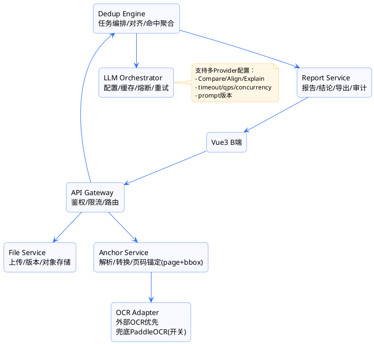

下面是一份可直接用于立项评审的「投标文件查重系统（页码定位/点击跳转/外接大模型算力/Vue3 B 端）」完整立项文档草案。你给的规模约束是**单标段同批次≤20 份**，因此方案会在“体验强、定位准、交付快”的前提下，把主要算力交给外接大模型 API，同时用**轻量解析+页码锚定**保证“可跳页高亮”的闭环。

---

# 1. 立项背景与问题陈述

## 1.1 背景

评标环节中常见以下风险：

* 投标人之间相互抄袭/套用方案，形成串标风险；
* 技术方案“改写式抄袭”肉眼难发现；
* 传统查重仅给出相似度，无法快速定位原文位置，人工复核成本高。

## 1.2 现状痛点

* **无法页码级定位**：查重报告不落到具体页码/段落，复核效率低；
* **无法一键跳转**：缺少“点击命中→打开 PDF 对照并高亮”的闭环；
* **算力与成本不可控**：全量 OCR/全量语义比对会造成资源浪费；
* **证据链薄弱**：缺少可审计的“命中段落—原因—规则—原文证据”。

---

# 2. 建设目标与范围

## 2.1 建设目标（必须达成）

1. **页码定位**：命中结果输出到 *docA 页码+高亮框* 与 *docB 页码+高亮框*。
2. **点击跳转**：B 端报告点击命中项 → 双栏 PDF 预览自动跳页并高亮。
3. **外接大模型为主算力**：语义比对、改写识别、解释生成通过**可配置的 LLM API**完成。
4. **低本地依赖**：本地仅做轻量解析/锚定/编排/缓存；OCR 优先可配置外部服务，必要时可接入开源 OCR 作为兜底。
5. **可审计**：对每次查重的输入/版本/提示词版本/模型版本/结果摘要留痕。

## 2.2 范围（一期）

* 支持文件类型：PDF（含文本层）、扫描 PDF（图片型）、DOCX（先转换 PDF 预览）
* 查重对象：同标段同批次（≤20 份）
* 输出：文档级、章节/块级、命中片段级（可跳页高亮）
* 管理能力：模型配置、阈值配置、任务管理、报告导出（PDF/HTML）

## 2.3 非范围（一期不做，二期再评估）

* 跨标段/跨项目大规模历史库的全库查重（需要向量库与更强索引体系）
* 多媒体（CAD/图片图纸）的深度比对（仅提供图片指纹/版式同源提示）

---

# 3. 业务角色与使用流程

## 3.1 角色

* 评标专家/评审秘书（主要使用者）
* 项目管理员（配置模型、阈值、查看审计）

## 3.2 关键流程（端到端）

1. 选择标段 → 选择同批次投标文件（或自动拉取）
2. 发起查重任务（可选择“快速/标准/深度”）
3. 系统解析并建立“页码锚定”（page+bbox）
4. 调用外接大模型进行对齐、比对、抽取命中片段与解释
5. 生成报告 → 列出命中项 → 点击进入双栏预览跳页高亮 → 人工确认/标记结论
6. 导出报告/归档审计

---

# 4. 核心能力设计：页码定位与跳转高亮

## 4.1 统一页面锚定模型（系统核心数据结构）

无论计算在不在本地，最终必须产出 `Anchor`：

```json
{
  "doc_id": "A",
  "page": 12,
  "highlights": [
    {"bbox":[x1,y1,x2,y2], "text":"命中句/片段", "confidence":0.93}
  ]
}
```

### 4.1.1 PDF 文本层（优先路径，几乎不耗算力）

* 解析每页 text blocks / lines，天然得到 page + bbox。
* 适配 PDF.js 坐标系（归一化或转换）。

### 4.1.2 扫描件（需要 OCR）

优先走可配置外部 OCR（不占本地算力），兜底可接开源 OCR：

* 外部 OCR：返回 lines/blocks + bbox + confidence
* 兜底 OCR：PaddleOCR（中文效果较好），仅在外部 OCR 不可用时启用

> 关键策略：**只 OCR 必要页**（见 7.2）。

## 4.2 “命中片段 → bbox”映射（保证高亮精准）

在锚定阶段，将页面文本切为可定位单元（推荐：**行级**，兼容 OCR）：

* 保存 `line_id -> (page, bbox, text, start_offset_in_block)`
  LLM 输出“命中句子/片段”后，本地用文本匹配（滑窗/包含匹配）映射回 line_id 集合，得到 bbox_list。

---

# 5. 查重规则体系（一期可落地、可解释）

> 一期重点在“能定位、能对照、能解释”。规则分三类：强规则、弱规则、免责规则。

## 5.1 强规则（命中即高风险）

* 技术/服务方案块语义相似度 ≥ 阈值（LLM 输出）
* 表格/清单（若可抽取）重合率高
* 同源版式/模板特征明显（可选：作者/Producer/字体组合/页眉页脚模式）

## 5.2 弱规则（累积分）

* 章节结构相似、标题序列相似
* 高频短语覆盖率高（剔除模板后）
* 参数表字段顺序高度一致

## 5.3 免责规则（降误判）

* 法定条款/固定模板段落（模板库剔除）
* 招标文件强制响应条款
* 资质附件复用（供应商自身合理复用）

---

# 6. 总体技术架构（后端）

## 6.1 架构原则

* 本地：轻解析 + 任务编排 + 缓存 + 审计
* 外部：LLM（语义比对/改写识别/解释生成）+ 可选外部 OCR
* 任务异步化：避免前端等待与长连接

## 6.2 服务拆分（建议）

1. **api-gateway**：鉴权、路由、限流、统一错误码
2. **file-service**：上传/版本/对象存储签名 URL
3. **anchor-service**：PDF/DOCX 转换、页码锚定、行级 bbox 映射
4. **ocr-adapter**：外部 OCR 调用 + 结果标准化 + 缓存；兜底 PaddleOCR（可开关）
5. **llm-orchestrator**：模型配置、调用治理（并发/超时/熔断/缓存/重试）
6. **dedup-engine**：任务编排、候选对齐、命中聚合、风险评分
7. **report-service**：报告聚合、结论标注、导出、审计日志

## 6.3 任务队列

* Redis Queue / RabbitMQ / Kafka 任一
* 任务状态：`PENDING/RUNNING/PARTIAL_SUCCESS/SUCCESS/FAILED/CANCELLED`

---

# 7. 关键实现策略：≤20 份文件的“LLM 主算力”最优做法

## 7.1 计算策略（避免 20 份全量两两深度比对）

理论两两对比是 C(20,2)=190 对。可以做，但成本不稳。建议采用“轻候选 + LLM 精算”：

**阶段 A：轻候选（本地超轻）**

* 仅用行级文本的 SimHash/MinHash 或简单 TF-IDF 召回候选块对（不算重算力）
* 目标：把每份文档需要 LLM 精算的 block 对控制在 **≤30 对**

**阶段 B：LLM 对齐与精算**

* LLM1（对齐）：输入双方章节/块摘要，输出疑似 block pairs（结构化 JSON）
* LLM2（精算）：对每对 block 输出：

  * `similarity_score`、`rewrite_risk`、`matched_spans`、`explanation`
* 本地将 spans 映射到 line bbox，生成 Anchor

## 7.2 OCR 策略（外部为主、按需触发）

* 每份文件先抽样页检测是否存在文本层
* 对扫描件：

  * **只 OCR**：LLM 对齐命中的候选页（或摘要判断疑似章节所在页）
  * 对于≤20份规模：默认每份 OCR 页数上限（如 10 页），超出改为“按需继续”

## 7.3 成本控制（必须项）

* LLM 调用缓存：`hash(textA+textB+prompt_version+model)`
* OCR 缓存：`hash(page_image)`
* 任务级并发限流：同任务最多 N 并发（如 5）
* 熔断降级：LLM 不可用时，仍输出“结构相似+表格重合+元数据同源”基础报告（不阻塞评标）

---

# 8. 外接大模型 API 设计（可配置、可治理）

## 8.1 Provider 抽象

* `CompareProvider`：语义相似度/改写识别（文本-文本）
* `AlignProvider`：章节/块对齐（结构-文本）
* `ExplainProvider`：生成解释（可与 Compare 合并）
* 可选：`VisionOCRProvider`（如果用多模态做 OCR/布局）

## 8.2 配置项（B 端可视化配置）

* endpoint、apiKey（加密存储）、modelName
* timeout、maxRetries、qps、concurrency
* promptVersion（版本化管理）
* 单次输入上限（字符/Token），超限自动分块
* 价格权重/优先级（多个模型时可路由）

## 8.3 审计与追溯

* 记录：模型、版本、提示词版本、输入 hash、输出摘要、耗时、错误码
* 不建议存全量输入明文（可选加密/脱敏存储）

---

# 9. 数据库设计（核心表）

> 以 PostgreSQL 为例；对象存储存文件与预览 PDF。

## 9.1 文档与锚定

* `doc`：doc_id, project_id, section_id, bidder_id, filename, sha256, status, created_at
* `doc_version`：version_id, doc_id, file_url, preview_pdf_url, parse_status
* `doc_page`：page_id, doc_id, page_no, width, height, image_url(optional), has_text_layer
* `doc_line`（关键）：line_id, doc_id, page_no, bbox, text, norm_text, confidence, block_id(optional)

## 9.2 任务与报告

* `dedup_job`：job_id, section_id, mode(快速/标准/深度), status, progress, created_by, created_at
* `dedup_pair`：pair_id, job_id, doc_a, doc_b, status, score_summary
* `dedup_hit`：hit_id, pair_id, score, risk_level, rule_hits(json), explanation, created_at
* `dedup_anchor`：anchor_id, hit_id, doc_id, page_no, bbox_list(json), snippet, confidence

## 9.3 配置与审计

* `llm_provider_config`：provider_id, type, endpoint, model, encrypted_key, timeout, qps, prompt_version, enabled
* `prompt_template`：prompt_version, template_text, updated_by, updated_at
* `invoke_log`：invoke_id, provider_id, job_id, purpose, input_hash, latency_ms, status, error

---

# 10. 后端 API 清单（前端对接）

## 10.1 文件与预览

* `POST /api/files/upload` → doc_id/version_id
* `GET /api/files/{doc_id}/preview` → 预览 PDF URL（给 PDF.js）
* `GET /api/docs/{doc_id}/pages/{pageNo}` → 页信息（尺寸/是否 OCR）

## 10.2 查重任务

* `POST /api/dedup/jobs`（section_id, mode, doc_ids[]）→ job_id
* `GET /api/dedup/jobs/{job_id}` → 状态/进度
* `GET /api/dedup/jobs/{job_id}/reports` → 报告概要
* `GET /api/dedup/reports/{report_id}/hits` → 命中列表（含页码摘要）
* `GET /api/dedup/hits/{hit_id}/anchors` → 双文档 anchors（用于跳转高亮）
* `POST /api/dedup/hits/{hit_id}/review` → 人工结论（确认/误报/待定 + 备注）

## 10.3 模型配置

* `GET/POST /api/config/llm-providers`
* `GET/POST /api/config/prompts`
* `POST /api/config/test-invoke`（测试连通性与返回格式）

---

# 11. 前端 B 端页面规划（Vue3）

## 11.1 技术栈建议

* Vue3 + Vite + TypeScript
* Vue Router + Pinia
* UI 组件库：Element Plus（经典 B 端）或 Naive UI（更现代）
* PDF 预览：PDF.js（核心）
* 表格/导出：xlsx、html2pdf（或后端导出）

## 11.2 信息架构（IA）

1. **标段查重任务**

   * 标段列表/详情
   * 投标文件列表（20份以内）
   * 发起查重（模式/阈值模板/模型选择）
2. **任务中心**

   * 任务列表（状态、进度、耗时、发起人）
   * 任务详情（pair 列表、风险分布）
3. **查重报告**

   * 报告概览（风险 Top、命中规则统计、投标人矩阵热力图）
   * 命中清单（可筛选：风险等级/章节/相似度区间）
   * **双栏对照预览（核心页）**
4. **配置中心**

   * LLM Provider 配置（多模型、开关、限流、测试）
   * OCR Provider 配置（外部/兜底开关）
   * 阈值与规则配置（模板段落库）
5. **审计与导出**

   * 调用日志（可按 job 过滤）
   * 报告导出/归档

## 11.3 核心页面：双栏对照预览（交互要点）

布局：左 docA，右 docB，中间命中导航栏。

功能点：

* 命中列表（左侧抽屉/上方列表）点击 → 自动：

  * 左右 PDF.js 跳页到 `page_no`
  * overlay 绘制 bbox 高亮框
* “上一处/下一处命中”快捷键
* 证据卡片：显示命中片段、相似度、改写风险、LLM 解释、规则命中
* 人工结论：确认疑似/误报/待定 + 备注（回写后端）

PDF.js 高亮实现：

* 每个 viewer 增加 overlay layer（绝对定位 canvas/div）
* bbox 坐标统一为页面像素坐标或归一化坐标（推荐归一化，随缩放自适应）

---

# 12. 核心时序（从发起到跳页高亮）

1. 前端发起 job
2. 后端入队：`anchor-service` 解析/转换 → 生成 doc_line（page+bbox）
3. `dedup-engine` 生成 pair（可先按投标人全组合 190 对，或按轻召回筛到更少）
4. 对每对 doc：

   * LLM 对齐（输出 block pairs）
   * LLM 精算（输出命中 spans + 解释）
   * spans→line 映射→anchors
5. report-service 聚合：risk 分、命中列表
6. 前端报告页展示
7. 点击命中 → 拉 anchors → PDF.js 跳页高亮

---

# 13. 非功能与安全

## 13.1 性能目标（≤20份规模）

* 发起到出首版报告：目标 3–10 分钟（取决于 LLM/OCR 响应）
* 双栏预览打开：<3s（预览 PDF 走 CDN/对象存储）
* 点击命中跳转：<300ms（anchors 已入库）

## 13.2 安全与合规

* APIKey 加密存储（KMS/字段加密）
* 外发大模型数据策略：

  * 默认仅发送“剔除模板后的片段”
  * 可配置脱敏（手机号/身份证/联系人）
  * 可配置是否允许外发附件类内容
* 全链路审计：任务、模型调用、人工结论留痕

---

# 14. 交付物与里程碑（建议）

## 一期（可上线闭环）

* 上传/解析/预览
* 查重任务与报告
* 双栏跳页高亮
* 外接 LLM 配置、审计日志
* OCR 外部适配 + 兜底开关

## 二期（增强）

* 模板段落库运营化（可视化维护、灰度）
* 更强的表格抽取与清单对比
* 跨项目历史库（向量库 + 权限隔离）

---

# 15. 附：LLM 输出协议（强约束，保证可落库与可定位）

要求 LLM 返回严格 JSON（后端校验）：

```json
{
  "pairs": [
    {
      "blockA_hint": "技术方案-总体思路",
      "blockB_hint": "技术方案-总体思路",
      "similarity": 0.86,
      "rewrite_risk": "HIGH",
      "matched_spans": {
        "A": ["……命中句1……", "……命中句2……"],
        "B": ["……对应句1……", "……对应句2……"]
      },
      "explanation": "两份文件在总体技术路线、关键步骤描述高度一致，仅替换了少量名词与参数。"
    }
  ]
}
```

后端用 `matched_spans` 在 `doc_line.norm_text` 上匹配，得到 line_id → bbox → anchors。

---

# 16. PlantUML 结构图（可用于评审稿）

（按你之前偏好的样式给一版，方便你直接贴进方案文档）



---

## 下一步我可以直接补齐到“可投产级”的两块细化（你不需要再补信息）

1. **Vue3 页面级组件结构与路由/状态设计**（含 PDF.js 双 viewer 高亮层实现要点、数据流、组件划分）
2. **后端任务编排与重试/幂等/缓存策略细则**（含表结构 DDL 草案、错误码、日志字段、并发参数默认值）

